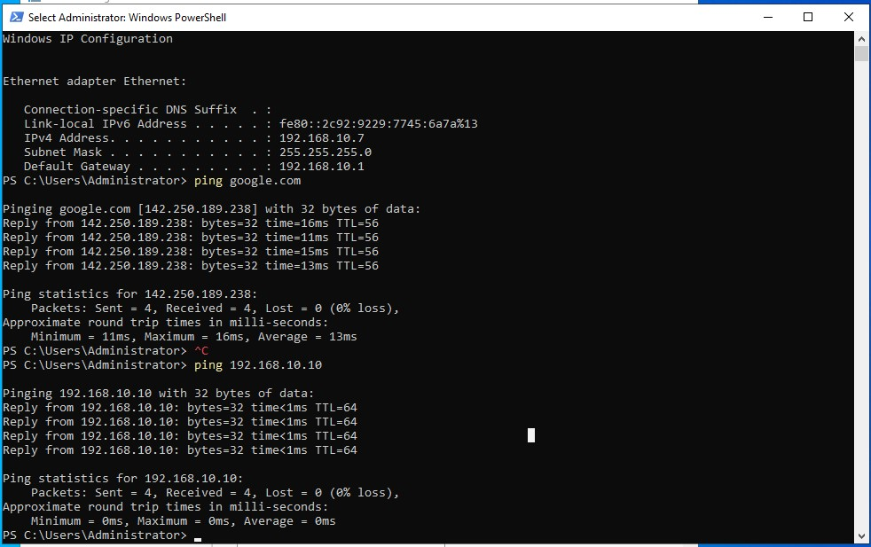
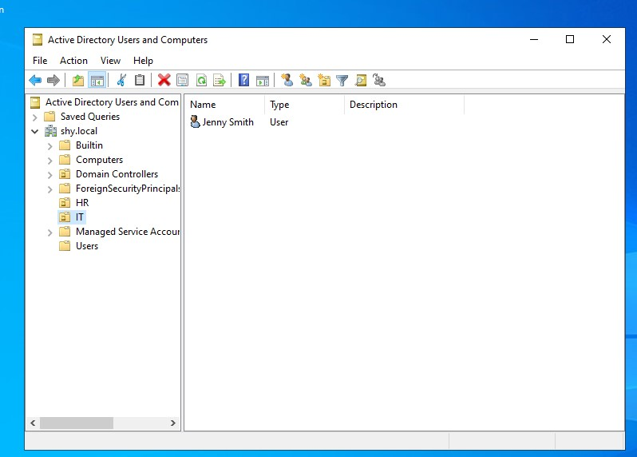
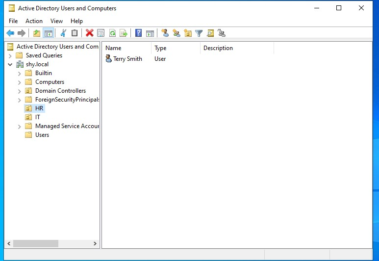
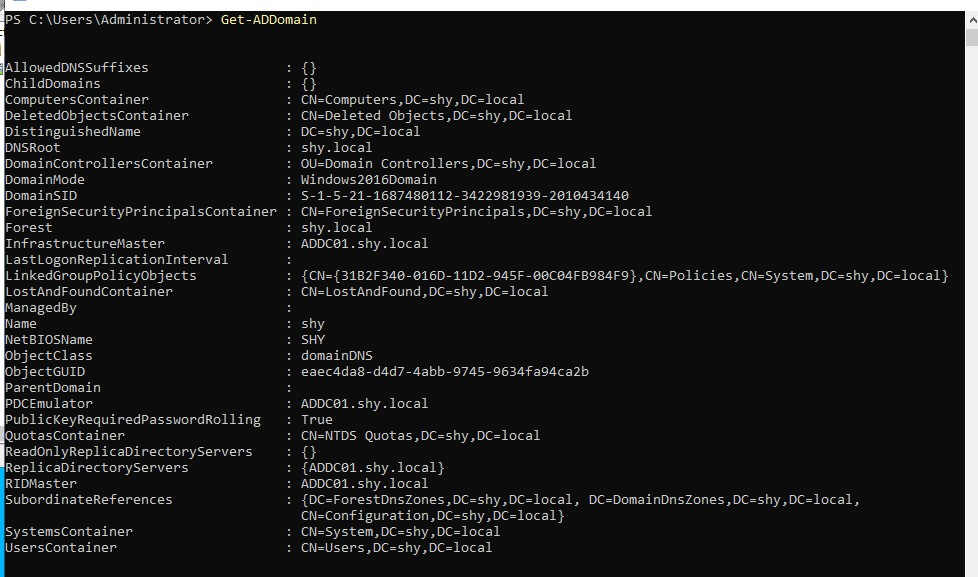

# Active Directory Setup

## Installing and Configuring Active Directory

### Setting a Static IP Address for the Windows Server
1. Right-click the **Network** icon in the bottom-right corner and select **Open Network & Internet settings**.
2. Click **Change adapter options**.
3. Right-click the network adapter and select **Properties**.
4. Double-click **Internet Protocol Version 4 (TCP/IPv4)**.
5. Select **Use the following IP address** and enter:
   - **IP Address:** `192.168.10.7`
   - **Subnet Mask:** `255.255.255.0`
   - **Default Gateway:** `192.168.10.1`
   - **Preferred DNS Server:** `8.8.8.8`
6. Click **OK** to save.
7. Open **Command Prompt** and type:
   ```powershell
   ipconfig
   ```
   Verify that the new IP address is set.
8. Test connectivity by pinging Google and the Splunk server (`192.168.10.10`).




---

## Installing Active Directory Domain Services (AD DS)
1. Open **Server Manager**.
2. Click **Manage** > **Add Roles and Features**.
3. Select **Role-based or feature-based installation** and click **Next**.
4. Select **Active Directory Domain Services (AD DS)** and click **Add Features**.
5. Click **Next** until you reach **Install**, then click **Install**.
6. Wait for installation to complete, then close the window.


## Promoting the Server to a Domain Controller
1. In **Server Manager**, click the **Flag Icon** and select **Promote this server to a domain controller**.
2. Select **Add a new forest** and enter the domain name: `shy.local`.
3. Click **Next** and set a **DSRM Password**.
4. Click **Next** through all steps and install.
5. The server will restart automatically.
6. After restart, log in with **Administrator** credentials.


## Creating Organizational Units (OUs) and Users
1. Open **Active Directory Users and Computers (ADUC)**.
2. Expand **shy.local**.
3. Right-click the domain and select **New > Organizational Unit**:
   - **IT** (for technical staff)
   - **HR** (for human resources)
4. To create users:
   - **IT Department:**
     1. Navigate to **IT**, right-click, and select **New > User**.
     2. Enter:
        - **First Name:** Jenny
        - **Last Name:** Smith
        - **Username (samAccountName):** `jsmith`
     3. Set a password and uncheck "User must change password at next logon".
     4. Click **Next** > **Finish**.
   - **HR Department:**
     1. Navigate to **HR**, right-click, and select **New > User**.
     2. Enter:
        - **First Name:** Terry
        - **Last Name:** Smith
        - **Username (samAccountName):** `tsmith`
     3. Set a password and uncheck "User must change password at next logon".
     4. Click **Next** > **Finish**.

**Screenshot:**



---

## Joining a Windows Machine to the Domain
1. Open **Advanced System Settings**.
2. Click **Change** under **Computer Name**.
3. Select **Domain** and enter `shy.local`.
4. If an error occurs, update DNS settings:
   1. Open **Network & Internet Settings**.
   2. Click **Change adapter options**.
   3. Right-click the network adapter > **Properties**.
   4. Double-click **Internet Protocol Version 4 (TCP/IPv4)**.
   5. Change **Preferred DNS Server** to `192.168.10.7` (Domain Controller).
   6. Click **OK**.
5. Try joining the domain again using the **Administrator** credentials.
6. Restart when prompted.
7. Log in as **Jenny Smith (jsmith)** under the domain.




---

## Summary
- **Active Directory Domain Services (AD DS) was installed** and the server was promoted to a domain controller.
- **Organizational Units (IT & HR) were created**.
- **Users (Jenny & Terry Smith) were added to their respective OUs**.
- **Windows Target PC was joined to the domain**.
- **DNS settings were updated to allow proper domain resolution**.


