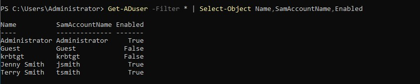
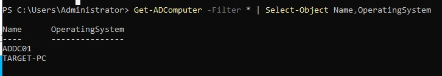

# Active Directory - Users & Groups

## Creating Organizational Units (OUs)
1. Open **Active Directory Users and Computers (ADUC)**.
2. Right-click the domain (**shy.local**), select **New**, then **Organizational Unit**.
3. Create the following OUs:
   - **IT** for technical staff
   - **HR** for human resources
4. Click **OK** to finalize.


## Creating Users via GUI
1. Open **Active Directory Users and Computers (ADUC)**.
2. Navigate to the **IT** OU for Jenny Smith or the **HR** OU for Terry Smith.
3. Right-click the **OU**, select **New**, then **User**.
4. Enter the following details:
   - **First Name:** Jenny
   - **Last Name:** Smith
   - **Username (samAccountName):** jsmith

   - **First Name:** Terry
   - **Last Name:** Smith
   - **Username (samAccountName):** tsmith

5. Click **Next**, set a password, and configure user settings.
6. Click **Finish** to complete the process.


---

## Creating Users via PowerShell
PowerShell allows automation for bulk user creation.

### **Command:**
```powershell
New-ADUser -Name "Terry Smith" -GivenName "Terry" -Surname "Smith" -UserPrincipalName "tsmith@shy.local" -SamAccountName "tsmith" -Path "OU=HR,DC=shy,DC=local" -AccountPassword (ConvertTo-SecureString "SecurePass123!" -AsPlainText -Force) -Enabled $true
```

---

## Verifying Users and Groups
Users can be verified in **GUI** or **PowerShell**.

### **Using GUI**
- Open **ADUC** and expand the **IT** and **HR** OUs.
- Ensure `tsmith` is under **HR** and `jsmith` is under **IT**.

### **Using PowerShell**
```powershell
Get-ADUser -Filter * | Select-Object Name,SamAccountName,Enabled
```




---

## Verifying Computers in Active Directory
To ensure all machines are registered properly:

### **Using PowerShell**
```powershell
Get-ADComputer -Filter * | Select-Object Name,OperatingSystem
```




---

## Verifying Domain Configuration

To check the domain configuration and settings:

### **Using PowerShell**
```powershell
Get-ADDomain
```


---

## Summary
- **OUs** help structure users logically within Active Directory.
- **Users** can be created manually through the **GUI** or automated with **PowerShell**.
- **Verification** ensures users are correctly placed within the appropriate **OUs**.

---
