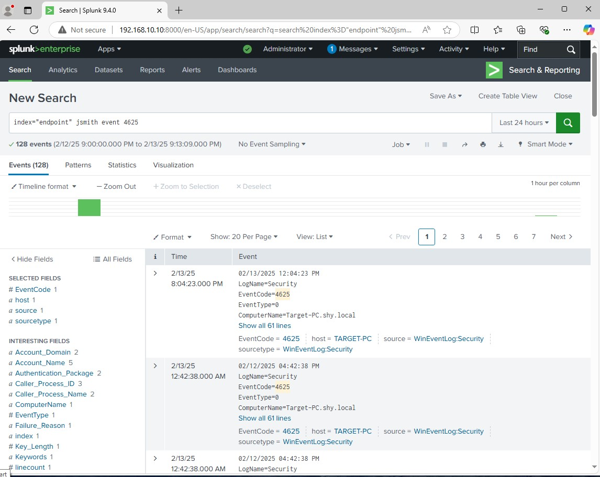
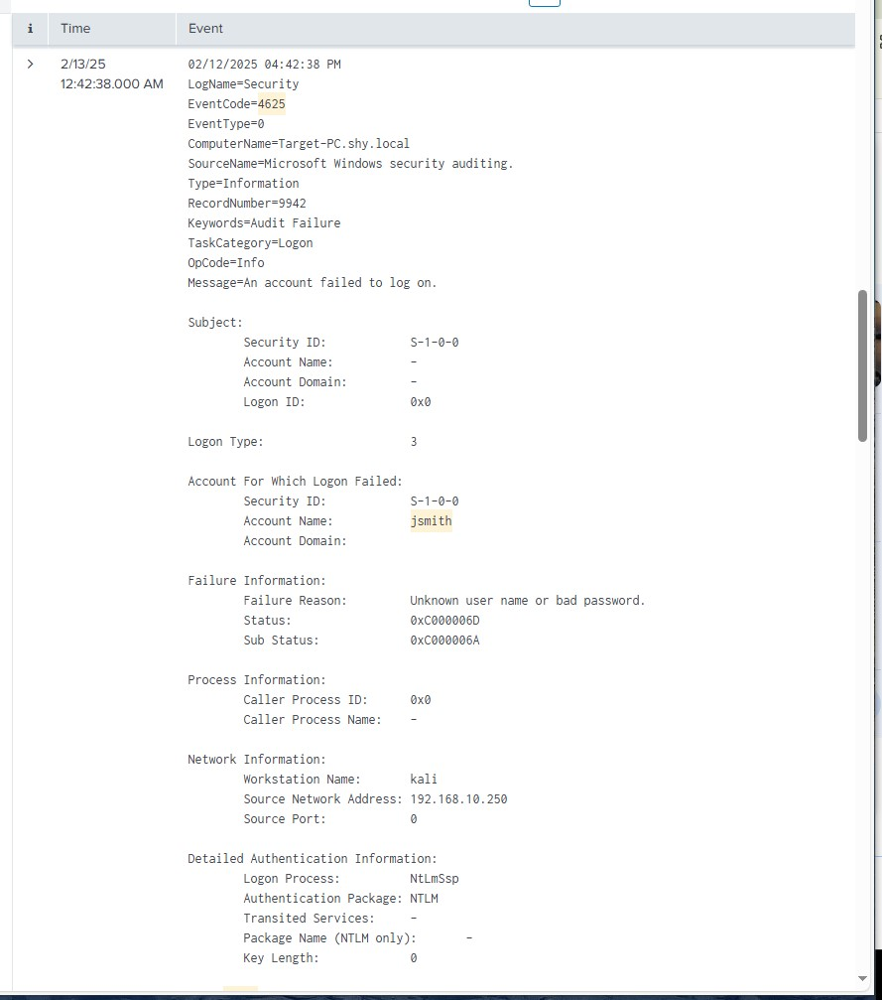
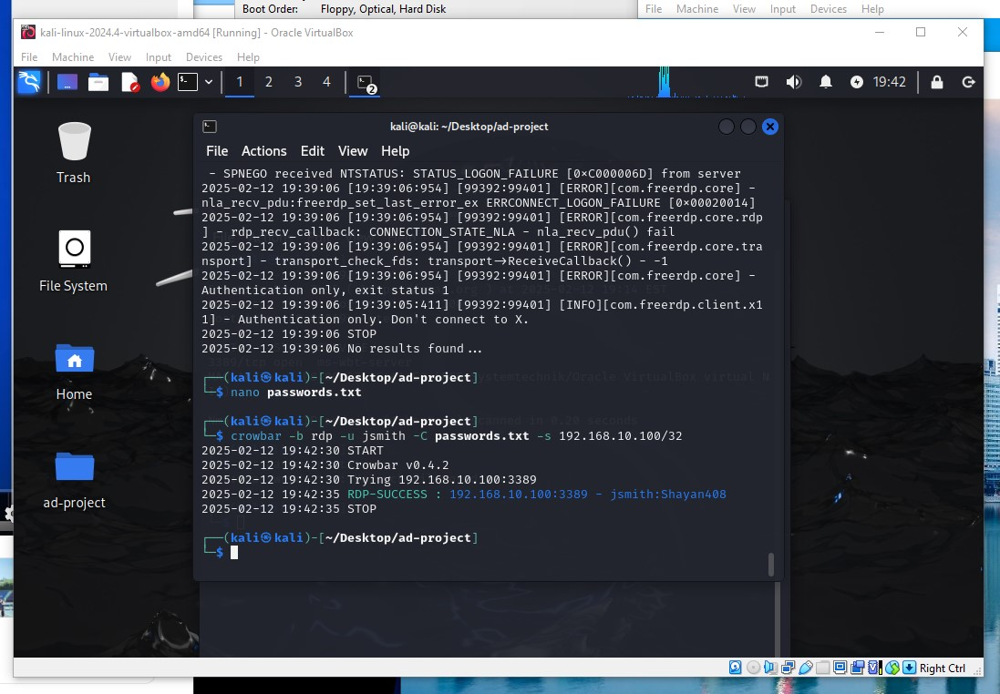

# Brute Force Attack

## Overview
This folder contains logs, screenshots, and files related to a brute-force attack simulation using **Crowbar** on a **Windows 10 target** in an Active Directory environment.

## Attack Details
- **Target**: Jenny Smith (`jsmith@shy.local`)
- **Tool Used**: Crowbar
- **Attack Type**: Remote Desktop Protocol (RDP) Brute Force
- **Command Executed**:
  ```bash
  crowbar -b rdp -u jsmith -C passwords.txt -s 192.168.10.100/32

## Screenshots
The following screenshots document the attack execution and results:

### **Failed Login Attempts Logged in Splunk**


### **Detailed Log of Failed Login in Splunk**


### **Successful Brute Force Attack Using Crowbar**


### **Windows Event Log Showing Successful Login (Event 4624)**


## Summary of Findings

###  Initial Detection
- Multiple failed login attempts detected in **Windows Security Logs** and **Splunk**.
- Security Event ID **4625** triggered for each failed attempt.

###  Attack Progression
- The brute-force attack continued until **valid credentials were found**.
- The attack was conducted using the **Crowbar tool**, targeting **RDP authentication**.

###  Successful Compromise
- A successful login was recorded with **Event ID 4624**.
- The compromised account was `jsmith@shy.local`, successfully authenticated from **192.168.10.250**.

###  Security Implications
 **Brute-force attacks generate a lot of noise**, making them easy to detect with proper monitoring.
 **Weak or guessable passwords** increase the risk of compromise.
 **No account lockout policies enabled**, allowing the attack to continue indefinitely.

###  Mitigation & Prevention
 **Enable Account Lockout Policies** – Prevent unlimited login attempts.  
 **Deploy Multi-Factor Authentication (MFA)** – Prevent unauthorized logins even if credentials are stolen.  
 **Use SIEM (e.g., Splunk) for Continuous Monitoring** – Detect brute-force patterns early.  
 **Harden RDP Access** – Restrict remote access using firewall rules, VPNs, or disabling RDP when not in use.  
