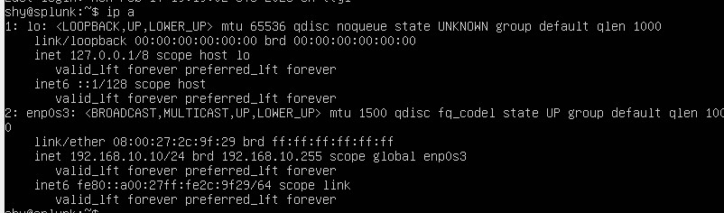
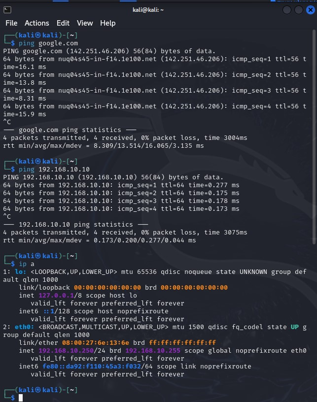

# Network Setup

This section documents the network configuration required for the Active Directory Lab environment. The configurations ensure proper communication between virtual machines, enable Remote Desktop access, and set up static IP addresses for key services.


## Setting Up Network Configuration for VMs
To ensure all virtual machines are on the same network, configure **VirtualBox** network settings.

1. Open **VirtualBox**.
2. Click on **Tools** → **Network** → **Nat Network**.
3. Create a new NAT Network with the following settings:
   - Network Name: `AD-Project`
   - IPv4 Prefix: `192.168.10.0/24`
   - Enable **DHCP Server**
4. Apply settings and assign this network to all virtual machines.

---


### **Configuring a Static IP for Splunk**
The Splunk Server runs on **Linux**, and a static IP is required for log forwarding and stability.

### **Steps:**
1. Open a terminal on the **Splunk Server**.
2. Edit the network configuration file:
   - For **Ubuntu/Debian**, run:
     ```sh
     sudo nano /etc/netplan/01-netcfg.yaml
     ```
   - For **CentOS/RHEL**, run:
     ```sh
     sudo nano /etc/sysconfig/network-scripts/ifcfg-ens192
     ```
3. Set the following static IP configuration:
   - **IP Address:** `192.168.10.10`
   - **Subnet Mask:** `255.255.255.0`
   - **Gateway:** `192.168.10.1`
   - **DNS Server:** `8.8.8.8`
4. Save the file.
5. Apply the changes:
   - For **Ubuntu/Debian**, run:
     ```sh
     sudo netplan apply
     ```
   - For **CentOS/RHEL**, restart the network:
     ```sh
     sudo systemctl restart NetworkManager
     ```
6. Verify the new settings using:
   ```sh
   ip a




---
### **Windows Server**
1. Open **Network & Internet Settings** → **Change Adapter Options**.
2. Right-click **Ethernet** → **Properties**.
3. Select **Internet Protocol Version 4 (TCP/IPv4)** → **Properties**.
4. Configure the following:
   - **IP Address:** `192.168.10.7`
   - **Subnet Mask:** `255.255.255.0`
   - **Default Gateway:** `192.168.10.1`
   - **DNS Server:** `8.8.8.8`
5. Save and restart.

---
### **Windows 10 Host**
The Windows 10 machine in the environment needs proper DNS settings to allow domain communication.

### **Steps:**
1. Open **Network and Sharing Center**.
2. Click on **Ethernet** (or Wi-Fi if applicable).
3. Select **Properties** and open **Internet Protocol Version 4 (TCP/IPv4)**.
4. Configure the following IP settings:
   - **IP Address:** `192.168.10.100`
   - **Subnet Mask:** `255.255.255.0`
   - **Default Gateway:** `192.168.10.1`
5. Configure the DNS settings:
   - **Preferred DNS Server:** `8.8.8.8` (Google Public DNS)
6. Click **OK** and **Apply** the settings, then restart the network connection.


---
### **Kali Linux**
1. Open **Network Settings** in Kali.
2. Change **IPv4 Settings** to **Manual**.
3. Set:
   - **IP Address:** `192.168.10.250`
   - **Subnet Mask:** `255.255.255.0`
   - **Gateway:** `192.168.10.1`
   - **DNS Server:** `8.8.8.8`
4. Disconnect and reconnect the network adapter to apply changes.




---
### Summary
- Each machine must be assigned a **static IP** for communication.
- A static IP is assigned to the Splunk server for consistent log forwarding.
- The Windows 10 workstation is configured with proper DNS settings for domain resolution.

These configurations ensure smooth operation of the Active Directory Lab environment.

