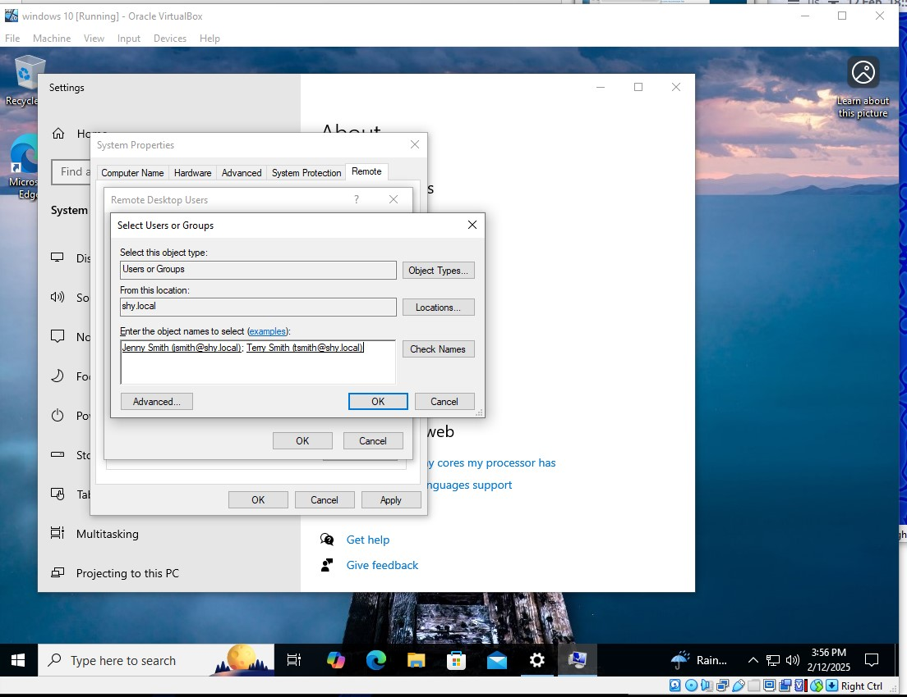
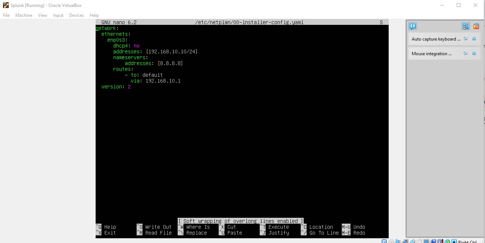
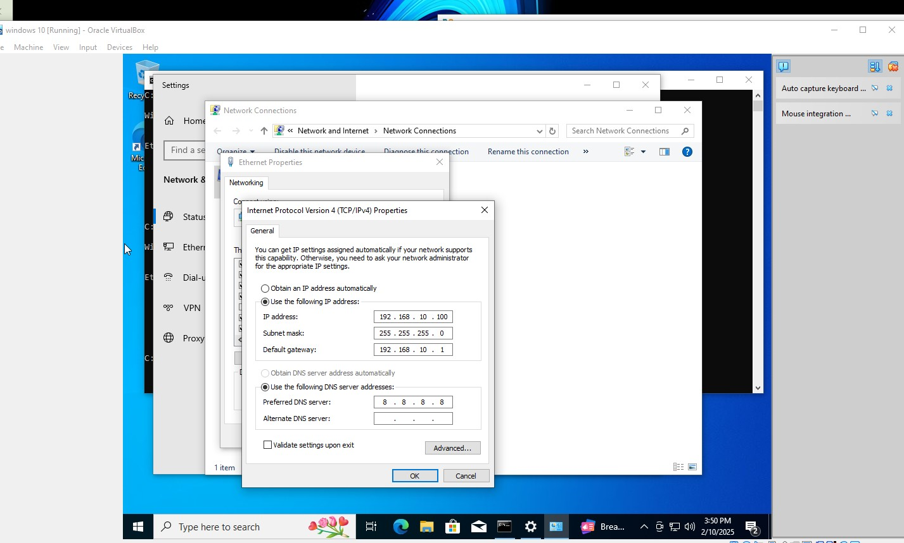

# Network Setup

This section documents the network configuration required for the Active Directory Lab environment. The configurations ensure proper communication between virtual machines, enable Remote Desktop access, and set up static IP addresses for key services.

## Enabling Remote Desktop for Users
To allow users to connect remotely to specific machines in the domain, Remote Desktop must be enabled and configured with appropriate permissions.

### Steps:
1. Open **System Properties**.
2. Navigate to the **Remote** tab.
3. Enable **Allow remote connections to this computer**.
4. Configure **Remote Desktop Users** to specify which accounts can connect.




---

### **Configuring a Static IP for Splunk**
The Splunk Server runs on **Linux**, and a static IP is required for log forwarding and stability.

### **Steps:**
1. Open a terminal on the **Splunk Server**.
2. Edit the network configuration file:
   - For **Ubuntu/Debian**, run:
     ```sh
     sudo nano /etc/netplan/01-netcfg.yaml
     ```
   - For **CentOS/RHEL**, run:
     ```sh
     sudo nano /etc/sysconfig/network-scripts/ifcfg-ens192
     ```
3. Set the following static IP configuration:
   - **IP Address:** `192.168.10.10`
   - **Subnet Mask:** `255.255.255.0`
   - **Gateway:** `192.168.10.1`
   - **DNS Server:** `8.8.8.8`
4. Save the file.
5. Apply the changes:
   - For **Ubuntu/Debian**, run:
     ```sh
     sudo netplan apply
     ```
   - For **CentOS/RHEL**, restart the network:
     ```sh
     sudo systemctl restart NetworkManager
     ```
6. Verify the new settings using:
   ```sh
   ip a




---

### **Windows 10 Network Configuration**
The Windows 10 machine in the environment needs proper DNS settings to allow domain communication.

### **Steps:**
1. Open **Network and Sharing Center**.
2. Click on **Ethernet** (or Wi-Fi if applicable).
3. Select **Properties** and open **Internet Protocol Version 4 (TCP/IPv4)**.
4. Configure the following IP settings:
   - **IP Address:** `192.168.10.100`
   - **Subnet Mask:** `255.255.255.0`
   - **Default Gateway:** `192.168.10.1`
5. Configure the DNS settings:
   - **Preferred DNS Server:** `8.8.8.8` (Google Public DNS)
6. Click **OK** and **Apply** the settings, then restart the network connection.




---

### Summary
- Remote Desktop is enabled to allow administrative access.
- A static IP is assigned to the Splunk server for consistent log forwarding.
- The Windows 10 workstation is configured with proper DNS settings for domain resolution.

These configurations ensure smooth operation of the Active Directory Lab environment.

